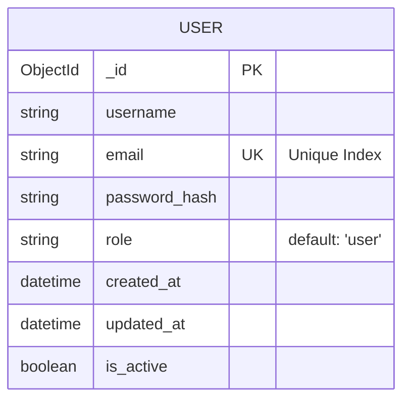

# 🔐 Auth System Enterprise


> A production-grade Authentication and User Management solution, built with modern architecture, security best practices, and scalability in mind.

---

## Important Note (Render Free Tier)

**Please Read Before Testing:**
This project is hosted on **Render's Free Tier**. The server automatically spins down after 15 minutes of inactivity.

1.  **First Step:** Click on the **Backend URL** (below) to "wake up" the server.
2.  **Wait:** It might take up to **50 seconds** for the first request to respond.
3.  **Then:** You can proceed to the Frontend and Log in.

---

## Live Demo

* **Frontend (Vercel):** [Vercel Link](https://user-authentication-roan.vercel.app/)
* **Backend (Render):**  [Render Link](https://user-authentication-5ebj.onrender.com)

### Test Credentials
To facilitate testing, the system comes with a pre-configured admin account:
* **Email:** `admin@example.com`
* **Password:** `admin123`

---

## 🛠️ Tech Stack

### Backend (Python)
* **FastAPI:** High-performance web framework for building APIs.
* **Beanie (ODM):** Asynchronous MongoDB Object-Document Mapper.
* **Poetry:** Professional dependency management.
* **Security:** OAuth2 implementation with JWT (JSON Web Tokens) and Bcrypt hashing.

### Frontend (TypeScript)
* **Next.js 16:** React framework with App Router and Server Components.
* **Tailwind CSS v4:** Utility-first CSS framework for rapid UI development.
* **Axios:** HTTP client with interceptors for automatic token injection.
* **React Hook Form:** Performant form validation.

---

## Architecture

The project follows **Clean Architecture** principles and **Separation of Concerns**:

```mermaid
sequenceDiagram
    participant User
    participant Frontend (Next.js)
    participant API (FastAPI)
    participant DB (MongoDB)

    User->>Frontend: Digita Email/Senha
    Frontend->>API: POST /api/v1/auth/login
    API->>DB: Busca User por Email
    DB-->>API: Retorna User Data
    API->>API: Verifica Hash da Senha (Bcrypt)
    
    alt Senha Inválida
        API-->>Frontend: 401 Unauthorized
        Frontend-->>User: Exibe Erro
    else Senha Válida
        API->>API: Gera Access Token (JWT)
        API-->>Frontend: 200 OK {access_token, token_type}
        Frontend->>Frontend: Armazena Token (Cookie/Storage)
        Frontend->>User: Redireciona p/ Dashboard
    end
```




## Local Installation
- Prerequisites
- Python 3.11+
- Node.js 20+
- Poetry

```bash
cd backend
# Install dependencies
poetry install

# Activate virtual env
poetry shell

# Start server
uvicorn app.main:app --reload
```

## Backend Setup

```bash
cd backend
# Install dependencies
poetry install

# Activate virtual env
poetry shell

# Start server
uvicorn app.main:app --reload
```

## Frontend Setup
```bash
cd frontend
# Install dependencies
npm install

# Start dev server
npm run dev
```

## Environment Variables (.env)

### Backend (/backend/.env)
```bash
SECRET_KEY=your_super_secret_key
ALGORITHM=HS256
ACCESS_TOKEN_EXPIRE_MINUTES=30
MONGO_URI=mongodb+srv://<user>:<pass>@cluster.mongodb.net/auth_db
```

### Frontend (/frontend/.env.local)
```bash
NEXT_PUBLIC_API_URL=http://127.0.0.1:8000/api/v1
```

# Author
Pablo Miguel Dias Ortiz - Full Stack Developer